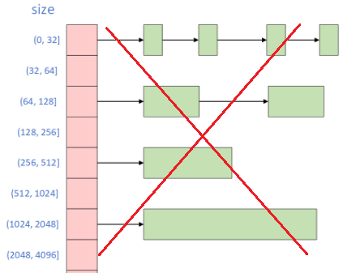
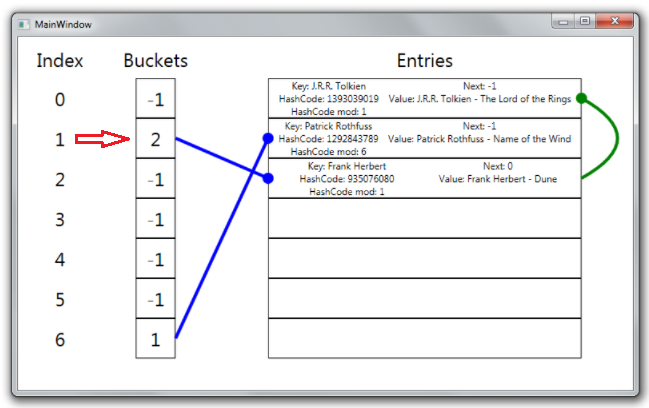
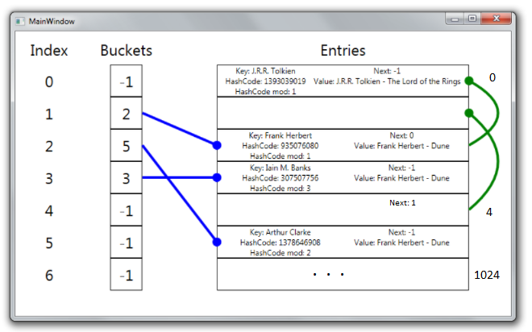
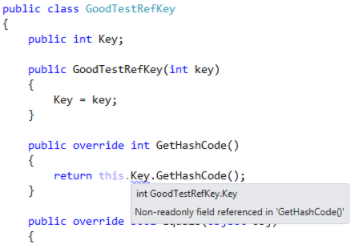

Demystifying Dictionary
==============================

This tutorial is based on [Back to basics: Dictionary](https://blog.markvincze.com/back-to-basics-dictionary-part-1/) and the source code doesn't contain serialization/deserialization related code for simplicity.

A hash table (or hash map) is a data structure implementing one of the most fundamental containers: the associative array. The associative array is a structure, which maps keys to values. The basic operation of such a container is the lookup, which - as the name suggests - looks up a value based on its key. The hash map is implemented in a way to make this lookup operation as quick as possible, ideally needing only a constant amount of time.

You might hear ***buckets*** when dealing with Dictionary. Buckets is just an `int[]` array (You'll see the implement details later), buckets is not seperate sections that each section that contains a sequence of items that as you might think in the beginning. For example, I originally thought buckets is an array that each element is a single linked list (like a segregated free list in heap memory) as:



But it is not like this. You will see all the item in a Dictionary is stored continuously in a large array, and each element of the bucket array is just an int (a "int pointer"):

```C#
var book1 = new Book("J.R.R. Tolkien", "The Lord of the Rings");
var book2 = new Book("Patrick Rothfuss", "Name of the Wind");

var dict = new Dictionary<string, Book>(5)
{
    { book1.Author, book1 },
    { book2.Author, book2 },
};
```


You will see an concrete example in the later section soon, let's first look at `System.Collections.Generic.Dictionary` class. 
```C#
public class Dictionary<TKey,TValue>: ... {
  
   public Dictionary();
   public Dictionary(int capacity);
   public Dictionary(IEqualityComparer<TKey> comparer);
   public Dictionary(int capacity, IEqualityComparer<TKey> comparer);

   public Dictionary(IDictionary<TKey,TValue> dictionary, IEqualityComparer<TKey> comparer);  
   ...
   public TValue this[TKey key] { get; set; }   // throw KeyNotFoundException if key is not found 
   public bool TryGetValue(TKey key, out TValue value);  // return false if key is not found instead of throwing an exception like indexer

   public ValueCollection Values { get; }
   public KeyCollection Keys { get; }
   public IEqualityComparer<TKey> Comparer { get; }
   public int Count { get; }

   public void Add(TKey key, TValue value);
   public void Clear();   // Removes all keys and values
   public bool ContainsKey(TKey key);
   public bool ContainsValue(TValue value);

   public bool Remove(TKey key);  // Removes the value with the specified key
   ...
}
```


## Source Code

```C#
public class Dictionary<TKey,TValue>: IDictionary<TKey,TValue>, IDictionary, IEnumerable<KeyValuePair<TKey, TValue>>, IReadOnlyDictionary<TKey, TValue>, ISerializable, IDeserializationCallback {
   private struct Entry {
      public int hashCode;   // Lower 31 bits of hash code, -1 if unused
      public int next;       // Index of next entry, -1 if last
      public TKey key;
      public TValue value;   
   }
   private Entry[] entries; // this array is the biggest, most important part of Dictionary.
   private int[] buckets;
   private int count;       // count is NOT the number of key/value pairs contained in the dictionary. 
   private int freeList;
   private int freeCount;   // how many "holes" in the array that store key/value pairs
   private KeyCollection keys;
   private ValueCollection values;
   private IEqualityComparer<TKey> comparer;
   private KeyCollection keys;
   private ValueCollection values;

   public Dictionary(): this(0, null) {}

   public Dictionary(int capacity): this(capacity, null) { }   // capacity: The initial number of elements that the dictionary can contains

   public Dictionary(IEqualityComparer<TKey> comparer): this(0, comparer) { }

   public Dictionary(int capacity, IEqualityComparer<TKey> comparer) 
   {
      if (capacity < 0)
         ThrowHelper.ThrowArgumentOutOfRangeException(ExceptionArgument.capacity);
 
      if (capacity > 0)
         Initialize(capacity);
 
      if (!typeof(TKey).IsValueType)
      {
         _comparer = comparer ?? EqualityComparer<TKey>.Default;
 
         if (typeof(TKey) == typeof(string) && NonRandomizedStringEqualityComparer.GetStringComparer(_comparer!) is IEqualityComparer<string> stringComparer)
         {
             _comparer = (IEqualityComparer<TKey>)stringComparer;
         }
      }
      else if (comparer is not null && comparer != EqualityComparer<TKey>.Default)
      {
         _comparer = comparer;
      }
   }

   public Dictionary(IDictionary<TKey,TValue> dictionary, IEqualityComparer<TKey> comparer): this(dictionary != null? dictionary.Count: 0, comparer) {
      if (dictionary == null)
         ThrowHelper.ThrowArgumentNullException(ExceptionArgument.dictionary);
      foreach (KeyValuePair<TKey,TValue> pair in dictionary) {
         Insert(key, value, true);
      }
   }

   private int Initialize(int capacity)
   {
      int size = HashHelpers.GetPrime(capacity);
      int[] buckets = new int[size];
      Entry[] entries = new Entry[size];

      _freeList = -1;
      _buckets = buckets;
      _entries = entries;
 
      return size;
   }
   
   /*
   public struct KeyValuePair<TKey, TValue> {
      private TKey key;
      private TValue value;
      ...// a constructor, getter, setter for key, value
   }
   */
   // ...
   public int Count { 
      get { return count - freeCount; }  // This is important to know the underlying structure
   }

   public TValue this[TKey key] {
      get {
         int i = FindEntry(key);
         if (i >= 0) 
            return entries[i].value;
         ThrowHelper.ThrowKeyNotFoundException();
         return default(TValue);   // just make the code compile, execution will never reach here when key is invalid
      }
      set {
         Insert(key, value, false);
      }
   }
   
   private int FindEntry(TKey key) {
      if (key == null) {
         ThrowHelper.ThrowArgumentNullException(ExceptionArgument.key);
      }

      if (buckets != null) {
         int hashCode = comparer.GetHashCode(key) & 0x7FFFFFFF;
         for (int i = buckets[hashCode % buckets.Length]; i >= 0; i = entries[i].next) {
            if (entries[i].hashCode == hashCode && comparer.Equals(entries[i].key, key)) return i;  // <--------------------------
         }
      }
      return -1;
   }

   public bool ContainsKey(TKey key) {
      return FindEntry(key) >= 0;
   }

   public bool ContainsValue(TValue value) {
	   if (value == null) {
		  for (int i = 0; i < count; i++) {
			 if (entries[i].hashCode >= 0 && entries[i].value == null) return true;
		  }
	   }
	   else {
		  EqualityComparer<TValue> c = EqualityComparer<TValue>.Default;
		  for (int i = 0; i < count; i++) {
			 if (entries[i].hashCode >= 0 && c.Equals(entries[i].value, value)) 
				return true;
		  }
	   }
	   return false;
	}

   //------------------
   public KeyCollection Keys { 
      get {
         if (keys == null) 
            keys = new KeyCollection(this);
         return keys;   
      }
   }
   
   public sealed class KeyCollection: ICollection<TKey>, ICollection, IReadOnlyCollection<TKey> {
      private Dictionary<TKey,TValue> dictionary;

      public KeyCollection(Dictionary<TKey,TValue> dictionary) {
         this.dictionary = dictionary;
      }

      public Enumerator GetEnumerator() {
         return new Enumerator(dictionary);
      }
      ...
   }

   public struct Enumerator : IEnumerator<TKey>, System.Collections.IEnumerator {
       private Dictionary<TKey, TValue> dictionary;
       private int index;
       private TKey currentKey;

       public bool MoveNext() { ... }   // use dictionary.entries[index].hashCode >= 0 to add active elements
       ...
   }
   //----------------------
   public ValueCollection Values { get; } // same as above and has its own Enumerator below 

   public struct Enumerator : IEnumerator<TValue>, System.Collections.IEnumerator {
      ...
   }
   
   // This is the Dictionary its own Enumerator
   public struct Enumerator: IEnumerator<KeyValuePair<TKey,TValue>>, IDictionaryEnumerator {
      private Dictionary<TKey,TValue> dictionary;
      private int index;
      private KeyValuePair<TKey,TValue> current;

      public bool MoveNext() { ... }   // use dictionary.entries[index].hashCode >= 0 to add active elements
      ...
   }
   
   public void Add(TKey key, TValue value) {
      Insert(key, value, true);
   }

   // Called by Add method and indexer internally, add is true when calling Add method, false when using indexer
	private void Insert(TKey key, TValue value, bool add) {  
	   // Calculate the hash code of the key, eliminate negative values.
	   int hashCode = comparer.GetHashCode(key) & 0x7FFFFFFF;

	   // Calculate the remainder of the hashCode divided by the number of buckets.
	   int targetBucket = hashCode % buckets.Length;   // the initial length of bucket is implemention details

	   for (int i = buckets[targetBucket]; i >= 0; i = entries[i].next) {
		  if (entries[i].hashCode == hashCode && comparer.Equals(entries[i].key, key)) {
			 if (add) {
				ThrowHelper.ThrowArgumentException(ExceptionResource.Argument_AddingDuplicate);
			 }
			 entries[i].value = value;
			 return;
		  }
	   }
		
	   // TKey is not found, so add the TValue
	   int index;
	   if (freeCount > 0) {
		  // There is a "hole" in the entries array, because something has been removed.
		  // The first empty place is pointed to by freeList, we insert our entry there.
		  index = freeList;
		  freeList = entries[index].next;
		  freeCount--;
	   } 
	   else {
		  // There are two kinds of "holes", first kind is the one was used before but then removed, second kind is the ones hasn't been used 
		  if (count == entries.Length) {  <------------------------------------------------------------- (1)                               
			 Resize();  // resize the entry[] and copy the existing array to the new array, and recalculate and reassign hash code to existing element
			 targetBucket = hashCode % buckets.Length;  // this is needed because the buckets.Length will change due to the Resize() method
		  }

		  // We can simply take the next consecutive place in the entries array.
		  index = count;
		  count++;
	   }

	   // Setting the fields of the entry
	   entries[index].hashCode = hashCode; 
	   entries[index].next = buckets[targetBucket]; 
	   entries[index].key = key;
	   entries[index].value = value;
	   buckets[targetBucket] = index; // The bucket will point to the newly added entry from now on.
	}  
    
   private void Resize(int newSize, bool forceNewHashCodes = false)
   {
      Entry[] entries = new Entry[newSize];
 
      int count = _count;
      Array.Copy(_entries, entries, count);
 
      if (!typeof(TKey).IsValueType && forceNewHashCodes)
      {
         IEqualityComparer<TKey> comparer = _comparer = (IEqualityComparer<TKey>)((NonRandomizedStringEqualityComparer)_comparer).GetRandomizedEqualityComparer();
 
         for (int i = 0; i < count; i++)
         {
            if (entries[i].next >= -1)
            {
               entries[i].hashCode = (uint)comparer.GetHashCode(entries[i].key);
            }
         }
      }

      _buckets = new int[newSize];

      for (int i = 0; i < count; i++)
      {
         if (entries[i].next >= -1)
         {
            ref int bucket = ref GetBucket(entries[i].hashCode);
            entries[i].next = bucket - 1; // Value in _buckets is 1-based
            bucket = i + 1;
         }
      }
 
      _entries = entries;
   }

   public void Clear() {   // Removes all keys and values
      if (count > 0) {
         for (int i = 0; i < buckets.Length; i++) 
            buckets[i] = -1;
         Array.Clear(entries, 0, count);
         freeList = -1;
         count = 0;
         freeCount = 0;
      }
   }   

   public bool Remove(TKey key) {  // Removes the value with the specified key
      if (key == null) {
         ThrowHelper.ThrowArgumentNullException(ExceptionArgument.key);
      }

      if (buckets != null) {
         int hashCode = comparer.GetHashCode(key) & 0x7FFFFFFF;
         int bucket = hashCode % buckets.Length;
         int last = -1;
         for (int i = buckets[bucket]; i >= 0; last = i, i = entries[i].next) {
            if (entries[i].hashCode == hashCode && comparer.Equals(entries[i].key, key)) {
               if (last < 0) {
                  buckets[bucket] = entries[i].next;
               } else {
                  entries[last].next = entries[i].next;
               }
               entries[i].hashCode = -1;  // hashCode in Entry can be used as a bit to indicate whether the current entry is occupied or free 
               entries[i].next = freeList;
               entries[i].key = default(TKey);
               entries[i].value = default(TValue);
               freeList = i;
               freeCount++;
               return true;
            }
         }
      }
      return false;
   }
   ...
}
```
Every object stored in the dictionary is represented by an instance of the Entry struct:
```C#
private struct Entry {
    public int hashCode;   
    public int next;       
    public TKey key;
    public TValue value;
}
```
so `Entry` can be think of a wrapper of `TValue` and `TKey`. 
`next`, `freeList`,  `freeCount` might be hard to see how an int can "point" to the next item, let's put it on the back burner.

## An Concrete Example
**Step 1**-Add two books to the dictionary. Luckily the hashes of the keys from these two books will not collide:
```C#
var book1 = new Book("J.R.R. Tolkien", "The Lord of the Rings");
var book2 = new Book("Patrick Rothfuss", "Name of the Wind");

var dict = new Dictionary<string, Book>(5)
{
    { book1.Author, book1 },
    { book2.Author, book2 },
};
```


TKey is used to calculate the hashCode and then calculate the remainder of the hashCode divided by the number of buckets (`int targetBucket = hashCode % buckets.Length;`), `targetBucket` is the index in the picture, this index is used (`buckets[targetBucket]`) to get the "int pointer" which is an index of the Entries. Note that the Entries array is filled up **consecutively**.

**Step 2**-Now we insert a third element of which the remainder of its key hash will collide with an existing entry in the dictionary:
```C#
var book3 = new Book("Frank Herbert", "Dune");
dict.Add(book3.Author, book3);
```
The TKey of the new item is used to calculate to get the index, in this example, the index is 1 (the second element in the `int[] buckets`). The second item already has a value (0, which means the first element in the Entries array). We can see that the elements falling in the same bucket are chained together, with the Next field of the entry pointing to the next entry in the chain:



**Step 3**-Now we add some more elements to the dictionary, then remove two of them:
```C#
var book4 = new Book("Iain M. Banks", "Consider Phlebas");
var book5 = new Book("Isaac Asimov", "Foundation");
var book6 = new Book("Arthur Clarke", "2001: Space Odyssey");
dict.Add(...);  // add book4, book5, book6

dict.Remove(book2.Author);
dict.Remove(book5.Author);
```
After this, we can see, that the "holes" in the dictionary will be chained together the same way as collided entries are chained:



Let's look into **differenences between `count`, `Count`, `freeCount`, `freeList` and `entries.Length`** based on the above picture:
```C#
count = 6      // count is always the index of next available slot
Count = count - freeCount = 4
freeCount = 2  // 2 empty "holes"
freeList = 4   // 5th item in the Entries
entries.Length = 1024   // CLR always allocate a lot free slots in advance just like C++'s Vector
```
Now you see why in (1) when `freeCount` is already 0, why we still need to check `count == entries.Length` so see whether we already reach the last available slot, if there are still availbe slot to use, use it, if not, resize the Entries array. But you need to be aware that freeList needs to be used first (`if (freeCount > 0)`) to make the data structure efficient.


## Some Observations

* Dictionary's internal data structure that stores items is array, just like `List<T>`

* TKey and TValue are saved together in the struct `Entry`. I originally though only TValue is saved, TKey is not saved. But you need to know the reason TKey is saved in the struct with TValue together is: TKey will be used `IEqualityComparer` to check whether two keys are the same or not as the last effort, note that saved hash code will be used first as a quick way to determine equality of two keys.

* Buckets is just in integer array, Not array of pointers that each element points to a sub memory

* Access(get, not set) TValue using this `[TKey key]` indexer when TKey is not valid will throw an exception. If you don't want an exception to be thrown, use `TryGetValue(TKey key, out TValue value)`

* hashCode in Entry is used to tell if the current element is part of freeList. You see `entries[i].hashCode >= 0` used in many places. For example, hashCode is checked in TKey, TValue, Dictionary's Enumerators to only add active elements

* Call Add with an existing TKey throws an exception, however, using index to set is fine

Based on the source code, you will see using indexer to change TValue for existing TKey is OK, it will override the existing TValue (`Entry` struct, to be precisely). But a duplicated key exception will be thrown if using Add method to add an element when the key already exists in the dictionary.

## TKey-Reference Types

The hash code of a reference type object is calculated based on its reference, and not its value, with the `RuntimeHelpers.GetHashCode` method:
```C#
public class Object {
   ...
   public virtual int GetHashCode()
   {
      return RuntimeHelpers.GetHashCode(this);
   }
}
```
What this means is that the value of the hash code does not depend on the values of the object's fields at all. This can be confusing, imagine that you implement the following class to be used as a key.
```C#
public class TestRefKey
{
    public readonly int Key;

    public TestRefKey(int key)
    {
        Key = key;
    }
}
```
You store an item in a Dictionary with such a key, then you create the same key and try to get the item from the Dictionary, it will not be found:
```C#
var dict = new Dictionary<TestRefKey, string>();
var key1 = new TestRefKey(5);
dict.Add(key1, "hello");
var key2 = new TestRefKey(5);
var item = dict[key2]; // This throws a KeyNotFoundException.
```
In the above example, because the two keys are different objects, even if their internal "state" is the same, we won't find the object we stored, because the hash code of the reference type object is calculated based on the object’s reference, rather than its value. If you would like to use a custom reference type as a Dictionary key, you should override its Equals and GetHashCode methods, and make the implementation based on the fields you want to make part of the hash key. For the above class, the following is a correct implementation:
```C#
public class GoodTestRefKey
{
   public readonly int Key;

   public GoodTestRefKey(int key) {
        Key = key;
   }

   public override int GetHashCode() {
      return this.Key.GetHashCode();
   }

   public override bool Equals(object obj) { // Better implement IEquatable<GoodTestRefKey>
      if (obj == null || GetType() != obj.GetType())
         return false;

      var other = (GoodTestRefKey) obj;
      return this.Key == other.Key;
   }
}
```

## TKey-Value Types

If the `GetHashCode` is not overridden for a value type, then the `ValueType.GetHashCode` method will be called, which looks up all the fields with **reflection**, and calculates a hash code based on their values. This implicates that value type objects with the same field values will have the same hash code by default, so they are safe to be used as Dictionary keys. It's important to keep in mind that the default implementation takes into account all fields in the struct, so a difference in any of the fields will mean a difference in the hash code as well. If we want to have only a subset of the fields affecting the hash code, we should implement a custom GetHashCode method.

## Immutable TKey Reference Types 

As you can see, TKey has to be immutable (value type structs are already immutable). So it is recommended to define `readonly` fields, if you don't do it, some extension tool like resharper will generating a warning as:



Now you should see **why you need to override `GetHashCode()` together when overriding `Equals(...)`**, becuase you might need `GetHashCode()` when you use this type as TKey in a Dictinary, even though you might not want to use this type as TKey in Dictionary, but who knows?

Let's see what happen if you only overide `Equals` method:
```C#
public class BadTestRefKey
{
   public readonly int Key;

   public GoodTestRefKey(int key) {
        Key = key;
   }

   // public override int GetHashCode() {
   //    return this.Key.GetHashCode();
   // }

   public override bool Equals(object obj) {
     ...
   }
}
```
One ramification is, you can add "duplicated" (in term of internal `Key` field) key to a dictionary, since each TValue will be added to different bucket. Adding duplicate might not be a problem, but it would be a problem if you want to retrieve a TValue back when constructing a TKey on the fly as:
```C#
var testDict = new Dictionary<BadTestRefKey, string>();
var keyAdd = new BadTestRefKey("2021");
testDict.Add(keyAdd, "Content");

// Later in another method, you already have the "metadata" of the TKey, 
// and you want to retrieve TValue back, this is a very common scenario
 
var keySearch = new BadTestRefKey("2021");
String s = testDict[keySearch];   // throw KeyNotFound exception
```
Now you should see why you cann't retrive the TValue back when you are condifent you will get it back since you know you have added it by the TKey, because you didn't override `GetHashCode()`, the dictionary is searching a wrong bucket.

## Concurrent Dictionary

-To work in the future, first review CLR via C#

```C#
public class ConcurrentDictionary<TKey, TValue> : IDictionary<TKey, TValue>, IDictionary, IReadOnlyDictionary<TKey, TValue> {
   
}
```

<style type="text/css">
.markdown-body {
  max-width: 1800px;
  margin-left: auto;
  margin-right: auto;
}
</style>

<link rel="stylesheet" href="./zCSS/bootstrap.min.css">
<script src="./zCSS/jquery-3.3.1.slim.min.js"></script>
<script src="./zCSS/popper.min.js"></script>
<script src="./zCSS/bootstrap.min.js"></script>