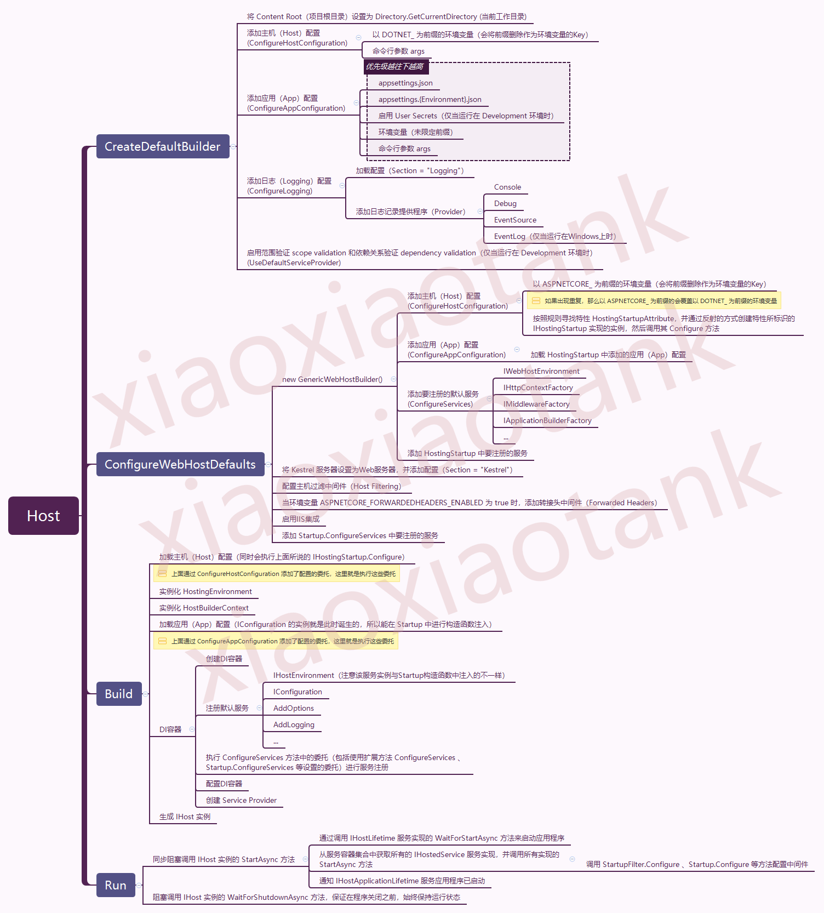

Demystifying `Host`
==============================

An **Host** is an object (check `internal sealed class Host`) that encapsulates an app's resources, such as:

* Dependency injection
* Logging
* Configuration
* IHostedService (background services, check `TimedHostedService` in CLR via C# Chapter 28)


Source Code:

```C#
public class Program {
   public static void Main(string[] args) {
      CreateHostBuilder(args).Build().Run();
   }

   public static IHostBuilder CreateHostBuilder(string[] args) => {
      Host.CreateDefaultBuilder(args)
          .ConfigureWebHostDefaults(webBuilder => {  
              webBuilder.UseStartup<Startup>();
          });
   });
}
```



```C#
public static class GenericHostBuilderExtensions
{
   public static IHostBuilder ConfigureWebHostDefaults(this IHostBuilder builder, Action<IWebHostBuilder> configure)
   {
      return builder.ConfigureWebHostDefaults(configure, _ => { });   
   }

   public static IHostBuilder ConfigureWebHostDefaults(this IHostBuilder builder, Action<IWebHostBuilder> configure, Action<WebHostBuilderOptions> configureOptions)
   {
      return builder.ConfigureWebHost(webHostBuilder =>  
      {
         WebHost.ConfigureWebDefaults(webHostBuilder);   
 
         // configure is webBuilder => webBuilder.UseStartup<Startup>();
         configure(webHostBuilder);    
      }, configureOptions);
   }
}

//-------------------------V
public static class WebHost
{
   // ...

   public static IWebHostBuilder CreateDefaultBuilder(string[] args)
   {
      var builder = new WebHostBuilder();
 
      if (string.IsNullOrEmpty(builder.GetSetting(WebHostDefaults.ContentRootKey)))
      {
         builder.UseContentRoot(Directory.GetCurrentDirectory());
      }

      if (args != null)
      {
         builder.UseConfiguration(new ConfigurationBuilder().AddCommandLine(args).Build());
      }

      builder.ConfigureAppConfiguration((hostingContext, config) =>
      {
         var env = hostingContext.HostingEnvironment;

         config.AddJsonFile("appsettings.json", optional: true, reloadOnChange: true)
               .AddJsonFile($"appsettings.{env.EnvironmentName}.json", optional: true, reloadOnChange: true);

         if (env.IsDevelopment())
         {
            if (!string.IsNullOrEmpty(env.ApplicationName))
            {
               var appAssembly = Assembly.Load(new AssemblyName(env.ApplicationName));
               if (appAssembly != null)
               {
                  config.AddUserSecrets(appAssembly, optional: true);
               }
            }
         }

         config.AddEnvironmentVariables();  // <-----------------AddEnvironmentVariables calls after AddJsonFile, that's why EnvironmentVariables overwrites appsetting.json
 
         if (args != null)
         {
            config.AddCommandLine(args);
         }
      })
      .ConfigureLogging((hostingContext, loggingBuilder) =>
      {
         loggingBuilder.Configure(options =>
         {
            options.ActivityTrackingOptions = ActivityTrackingOptions.SpanId| ActivityTrackingOptions.TraceId | ActivityTrackingOptions.ParentId;
         });

         loggingBuilder.AddConfiguration(hostingContext.Configuration.GetSection("Logging"));
         loggingBuilder.AddConsole();
         loggingBuilder.AddDebug();
         loggingBuilder.AddEventSourceLogger();
      }).
      UseDefaultServiceProvider((context, options) =>
      {
         options.ValidateScopes = context.HostingEnvironment.IsDevelopment();
      });
 
      ConfigureWebDefaults(builder);
 
      return builder;
   }

   internal static void ConfigureWebDefaults(IWebHostBuilder builder) 
   {
      builder.ConfigureAppConfiguration((ctx, cb) =>
      {
         if (ctx.HostingEnvironment.IsDevelopment())
         {
            StaticWebAssetsLoader.UseStaticWebAssets(ctx.HostingEnvironment, ctx.Configuration);
         }
      });
      builder.UseKestrel((builderContext, options) =>
      {
         options.Configure(builderContext.Configuration.GetSection("Kestrel"), reloadOnChange: true);
      })
      .ConfigureServices((hostingContext, services) =>
      {
         // Fallback
         services.PostConfigure<HostFilteringOptions>(options =>
         {
            if (options.AllowedHosts == null || options.AllowedHosts.Count == 0)
            {
               // "AllowedHosts": "localhost;127.0.0.1;[::1]"
               var hosts = hostingContext.Configuration["AllowedHosts"]?.Split(new[] { ';' }, StringSplitOptions.RemoveEmptyEntries);
               // Fall back to "*" to disable.
               options.AllowedHosts = (hosts?.Length > 0 ? hosts : new[] { "*" });
            }
         });
         // Change notification
         services.AddSingleton<IOptionsChangeTokenSource<HostFilteringOptions>>(new ConfigurationChangeTokenSource<HostFilteringOptions>(hostingContext.Configuration));
         services.AddTransient<IStartupFilter, HostFilteringStartupFilter>();
         services.AddTransient<IStartupFilter, ForwardedHeadersStartupFilter>();
         services.AddTransient<IConfigureOptions<ForwardedHeadersOptions>, ForwardedHeadersOptionsSetup>();

         services.AddRouting(); // <-----------------
        })
        .UseIIS()
        .UseIISIntegration();
    }
}
//-------------------------Ʌ

public interface IStartup
{
   IServiceProvider ConfigureServices(IServiceCollection services);
   void Configure(IApplicationBuilder app);
}

public static class GenericHostWebHostBuilderExtensions
{
   public static IHostBuilder ConfigureWebHost(this IHostBuilder builder, Action<IWebHostBuilder> configure, Action<WebHostBuilderOptions> configureWebHostBuilder)
   {
      // ...
      var webhostBuilder = new GenericWebHostBuilder(builder, webHostBuilderOptions);    
      configure(webhostBuilder);        
      builder.ConfigureServices((context, services) => services.AddHostedService<GenericWebHostService>());  // <---------------
      return builder;
   }
}

internal sealed class GenericWebHostBuilder : IWebHostBuilder, ISupportsStartup, ISupportsUseDefaultServiceProvider
{
   private readonly IHostBuilder _builder;
   private readonly IConfiguration _config;
   // ...

   public IWebHostBuilder ConfigureServices(Action<IServiceCollection> configureServices)
   {
      return ConfigureServices((context, services) => configureServices(services));
   }

   public IWebHostBuilder ConfigureServices(Action<WebHostBuilderContext, IServiceCollection> configureServices)
   {
      // call IHostBuilder.ConfigureServices()
      _builder.ConfigureServices((context, builder) =>  // builder is IServiceCollection
      {
         var webhostBuilderContext = GetWebHostBuilderContext(context);
         configureServices(webhostBuilderContext, builder);
      });
 
      return this;
    }

    // this method is important
    private void UseStartup([DynamicallyAccessedMembers(StartupLinkerOptions.Accessibility)] Type startupType, HostBuilderContext context, IServiceCollection services)
    {
       // ...
       instance ??= ActivatorUtilities.CreateInstance(new HostServiceProvider(webHostBuilderContext), startupType);

       // Startup.ConfigureServices
       var configureServicesBuilder = StartupLoader.FindConfigureServicesDelegate(startupType, context.HostingEnvironment.EnvironmentName);
       var configureServices = configureServicesBuilder.Build(instance);
 
       configureServices(services);   // <------------------------- call your Startup.cs's ConfigureServices to register your own services
    }
}

internal sealed partial class GenericWebHostService : IHostedService
{
   public GenericWebHostService(IOptions<GenericWebHostServiceOptions> options, IServer server, ILoggerFactory loggerFactory, DiagnosticListener diagnosticListener,
                                ActivitySource activitySource, DistributedContextPropagator propagator, IHttpContextFactory httpContextFactory,
                                IApplicationBuilderFactory applicationBuilderFactory, IEnumerable<IStartupFilter> startupFilters,
                                IConfiguration configuration, IWebHostEnvironment hostingEnvironment, HostingMetrics hostingMetrics)
   {
        Options = options.Value;
        Server = server;
        Logger = loggerFactory.CreateLogger("Microsoft.AspNetCore.Hosting.Diagnostics");
        LifetimeLogger = loggerFactory.CreateLogger("Microsoft.Hosting.Lifetime");
        DiagnosticListener = diagnosticListener;
        ActivitySource = activitySource;
        Propagator = propagator;
        HttpContextFactory = httpContextFactory;
        ApplicationBuilderFactory = applicationBuilderFactory;
        StartupFilters = startupFilters;
        Configuration = configuration;
        HostingEnvironment = hostingEnvironment;
        HostingMetrics = hostingMetrics;
   }
   
   public GenericWebHostServiceOptions Options { get; }
   public IServer Server { get; }
   public ILogger Logger { get; }
   public ILogger LifetimeLogger { get; }
   public DiagnosticListener DiagnosticListener { get; }
   public ActivitySource ActivitySource { get; }
   public DistributedContextPropagator Propagator { get; }
   public IHttpContextFactory HttpContextFactory { get; }
   public IApplicationBuilderFactory ApplicationBuilderFactory { get; }
   public IEnumerable<IStartupFilter> StartupFilters { get; }
   public IConfiguration Configuration { get; }
   public IWebHostEnvironment HostingEnvironment { get; }
   //

   public async Task StartAsync(CancellationToken cancellationToken)
   {
      // ...
      RequestDelegate application = null;

      //  builder is IApplicationBuilder
      var builder = ApplicationBuilderFactory.CreateBuilder(Server.Features);

      // build the request pipeline
      application = builder.Build();   // <--------------------------------------------- that's when all Middleware instances are created

      var httpApplication = new HostingApplication(application, Logger, DiagnosticListener, ActivitySource, Propagator, HttpContextFactory);
 
      await Server.StartAsync(httpApplication, cancellationToken);

      // ...
   }

   public async Task StopAsync(CancellationToken cancellationToken)
   {
      await Server.StopAsync(cancellationToken);
   }
}

public class ApplicationBuilderFactory : IApplicationBuilderFactory
{
   private readonly IServiceProvider _serviceProvider;

   public ApplicationBuilderFactory(IServiceProvider serviceProvider)
   {
      _serviceProvider = serviceProvider;
   }

   public IApplicationBuilder CreateBuilder(IFeatureCollection serverFeatures)
   {
      return new ApplicationBuilder(_serviceProvider, serverFeatures);
   }
}

public interface IServer : IDisposable
{
   IFeatureCollection Features { get; }

   Task StartAsync<TContext>(IHttpApplication<TContext> application, CancellationToken cancellationToken) where TContext : notnull;

   Task StopAsync(CancellationToken cancellationToken);
}

internal sealed class KestrelServerImpl : IServer
{
   // ...
}
```

When you register your own service in "Startup.cs", "Startup.cs"'s ConfigureServices method must somehow "connect" to the `HostBuilder` in "Program.cs"

So how does "Startup.cs"'s `ConfigureServices` method influence `HostBuilder`s `_configureServicesActions` so that the services you register in "Startup.cs" can be actually add to the Host in "Program.cs"? It is the `ConfigureWebHostDefaults` method acts as the bridge.

## `Host` Source Code

```C#
public static class HostingAbstractionsHostExtensions
{
   public static void Run(this IHost host)        // when that method exits, the application exits
   {
      host.RunAsync().GetAwaiter().GetResult();   // blocks until the method exits
   }
   
   public static async Task RunAsync(this IHost host, CancellationToken token = default)
   {
      try 
      {
         await host.StartAsync(token).ConfigureAwait(false);             // finish quickly
         await host.WaitForShutdownAsync(token).ConfigureAwait(false);   // the most of time, program stuck here
      }
      finally
      {
         // ...
         host.Dispose();
      }
   }

   public static async Task WaitForShutdownAsync(this IHost host, CancellationToken token = default)
   {
      // this is NOT ConsoleLifetime, 
      IHostApplicationLifetime applicationLifetime = host.Services.GetRequiredService<IHostApplicationLifetime>(); 

      var waitForStop = new TaskCompletionSource<object>(TaskCreationOptions.RunContinuationsAsynchronously);

      applicationLifetime.ApplicationStopping.Register(obj => 
      {
         var tcs = (TaskCompletionSource<object>)obj;
         tcs.TrySetResult(null);
      }, waitForStop);

      await waitForStop.Task;  // await the Task, this will block until ApplicationStopping is triggered
      await host.StopAsync();
   }
}

public partial class ConsoleLifetime : IHostLifetime, IDisposable
{
   private CancellationTokenRegistration _applicationStartedRegistration;
   private CancellationTokenRegistration _applicationStoppingRegistration;

   private IHostApplicationLifetime ApplicationLifetime { get; }   // via DI in ctor

   // ... ctor

   public Task WaitForStartAsync(CancellationToken cancellationToken)
   {
      // ...
      AppDomain.CurrentDomain.ProcessExit += OnProcessExit;   // attach event handlers for SIGTERM and Ctrl+C
      Console.CancelKeyPress += OnCancelKeyPress;

      return Task.CompletedTask;
   }

   public Task StopAsync(CancellationToken cancellationToken)
   {
      // there's nothing to do here
      return Task.CompletedTask;
   }

   private void OnProcessExit(object sender, EventArgs e)
   {
      ApplicationLifetime.StopApplication();  // <-----------------
      // ...
      System.Environment.ExitCode = 0;
   }

   private void OnCancelKeyPress(object sender, ConsoleCancelEventArgs e)
   {
      e.Cancel = true;
      ApplicationLifetime.StopApplication();  // <-----------------
   }
}

//--------------------V
public interface IHost : IDisposable
{
   IServiceProvider Services { get; }
   Task StartAsync(CancellationToken cancellationToken = default);
   Task StopAsync(CancellationToken cancellationToken = default);
}

internal sealed class Host : IHost, IAsyncDisposable  // namespace Microsoft.Extensions.Hosting.Internal
{
   private readonly ILogger<Host> _logger;
   private readonly IHostLifetime _hostLifetime;     //  ConsoleLifetime by default
   private readonly ApplicationLifetime _applicationLifetime;
   private readonly HostOptions _options;
   private readonly IHostEnvironment _hostEnvironment;
   private readonly PhysicalFileProvider _defaultProvider;
   private IEnumerable<IHostedService>? _hostedServices;  // <--------------- contains GenericWebHostService which runs Kestrel in the background
   private volatile bool _stopCalled;

   public Host(IServiceProvider services, IHostEnvironment hostEnvironment, PhysicalFileProvider defaultProvider, IHostApplicationLifetime applicationLifetime,
               ILogger<Host> logger, IHostLifetime hostLifetime, IOptions<HostOptions> options);
   
   public IServiceProvider Services { get; }

   public async Task StartAsync(CancellationToken cancellationToken = default)
   {
      _logger.Starting();
      using var combinedCancellationTokenSource = CancellationTokenSource.CreateLinkedTokenSource(cancellationToken, _applicationLifetime.ApplicationStopping);
      CancellationToken combinedCancellationToken = combinedCancellationTokenSource.Token;

      // return very quick, it just register event listener for SIGTERM and Ctrl+C 
      await _hostLifetime.WaitForStartAsync(combinedCancellationToken).ConfigureAwait(false);

      combinedCancellationToken.ThrowIfCancellationRequested();
      _hostedServices = Services.GetRequiredService<IEnumerable<IHostedService>>();   // that's how you can call AddHostedService to register your own IHostedService

      foreach (IHostedService hostedService in _hostedServices)  // start each background services (GenericWebHostService/Kestrel is the first one to start )
      {
         // fire IHostedService.Start
         await hostedService.StartAsync(combinedCancellationToken).ConfigureAwait(false);

         if (hostedService is BackgroundService backgroundService)
         {
            _ = TryExecuteBackgroundServiceAsync(backgroundService);
         }
      }

      // fire IHostApplicationLifetime.Started
      _applicationLifetime.NotifyStarted();

      _logger.Started();
   }

   private async Task TryExecuteBackgroundServiceAsync(BackgroundService backgroundService) 
   {
      // backgroundService.ExecuteTask may not be set (e.g. if the derived class doesn't call base.StartAsync)
      Task? backgroundTask = backgroundService.ExecuteTask;
      if (backgroundTask == null)
         return;

      try
      {
         await backgroundTask.ConfigureAwait(false);
      }
      catch (Exception ex)
      {
         // when the host is being stopped, it cancels the background services. This isn't an error condition, so don't log it as an error
         if (_stopCalled && backgroundTask.IsCanceled && ex is OperationCanceledException)
            return;

         _logger.BackgroundServiceFaulted(ex);
         if (_options.BackgroundServiceExceptionBehavior == BackgroundServiceExceptionBehavior.StopHost)
         {
            _logger.BackgroundServiceStoppingHost(ex);
            _applicationLifetime.StopApplication();
         }
      }
   }

   public async Task StopAsync(CancellationToken cancellationToken = default)
   {
      _stopCalled = true;
      _logger.Stopping();

      using (var cts = new CancellationTokenSource(_options.ShutdownTimeout))
      using (var linkedCts = CancellationTokenSource.CreateLinkedTokenSource(cts.Token, cancellationToken))
      {
         CancellationToken token = linkedCts.Token;
         _applicationLifetime.StopApplication();

         IList<Exception> exceptions = new List<Exception>();
         if (_hostedServices != null)  // started?
         {
            foreach (IHostedService hostedService in _hostedServices.Reverse())
            {
               try
               {
                  await hostedService.StopAsync(token).ConfigureAwait(false);
               }
               catch (Exception ex)
               {
                  exceptions.Add(ex);
               }
            }
         }

         _applicationLifetime.NotifyStopped();

         try
         {
            await _hostLifetime.StopAsync(token).ConfigureAwait(false);
         }
         catch (Exception ex)
         {
            exceptions.Add(ex);
         }
 
         if (exceptions.Count > 0)
         {
            var ex = new AggregateException("One or more hosted services failed to stop.", exceptions);
            _logger.StoppedWithException(ex);
            throw ex;
         }
      }
      _logger.Stopped();
   }

   // ...
}
//--------------------Ʌ


//-----------------------------V
public interface IHostedService   // provides a nice way to properly start background tasks in web applications, check the TimedHostedService Example in CLR via C# Chapter28
{
   Task StartAsync(CancellationToken cancellationToken);
   Task StopAsync(CancellationToken cancellationToken);
}

public abstract class BackgroundService : IHostedService, IDisposable   // let you write less code for implementing background tasks
{
   private Task _executeTask;
   private CancellationTokenSource? _stoppingCts;

   public virtual Task? ExecuteTask => _executeTask;

   protected abstract Task ExecuteAsync(CancellationToken stoppingToken);

   public virtual Task StartAsync(CancellationToken cancellationToken)
   {
      _stoppingCts = CancellationTokenSource.CreateLinkedTokenSource(cancellationToken);

      _executeTask = ExecuteAsync(_stoppingCts.Token);

      // if the task is completed then return it, this will bubble cancellation and failure to the caller
      if (_executeTask.IsCompleted)
      {
         return _executeTask;
      }

      // otherwise it's running
      return Task.CompletedTask;
   }

   public virtual async Task StopAsync(CancellationToken cancellationToken)
   {
      if (_executeTask == null)
         return;

      try
      {
         _stoppingCts!.Cancel();
      }
      finally
      {
         // wait until the task completes or the stop token triggers
         await Task.WhenAny(_executeTask, Task.Delay(Timeout.Infinite, cancellationToken)).ConfigureAwait(false);
      }
   }
}
//------------------------------Ʌ
```

```C#
//----------------------V
public static class Host {  // provides convenience methods for creating instances of Microsoft.Extensions.Hosting.IHostBuilder with pre-configured defaults

   public static IHostBuilder CreateDefaultBuilder() => CreateDefaultBuilder(args: null);

   public static IHostBuilder CreateDefaultBuilder(string[] args) {   // initializes a new instance of HostBuilder class with pre-configured defaults
      var builder = new HostBuilder();

      builder.UseContentRoot(Directory.GetCurrentDirectory());   // specify the content root directory to be used by the host.

      builder.ConfigureHostConfiguration(config => {             // config is IConfigurationBuilder
         config.AddEnvironmentVariables(prefix: "DOTNET_");
         if (args != null) {
            config.AddCommandLine(args);
         }
      });
      // ------------------Configures application settings, the is the main topic of this chapter----------------------------------------------
      builder.ConfigureAppConfiguration((hostingContext, config) => {   // hostingContext is HostBuilderContext, config is IConfigurationBuilder
          IHostEnvironment env = hostingContext.HostingEnvironment;
          bool reloadOnChange = hostingContext.Configuration.GetValue("hostBuilder:reloadConfigOnChange", defaultValue: true);

          config.AddJsonFile("appsettings.json", optional: true, reloadOnChange: reloadOnChange)   // You can see that appsettings.json will always be used
                .AddJsonFile($"appsettings.{env.EnvironmentName}.json", optional: true, reloadOnChange: reloadOnChange);

          if (env.IsDevelopment() && !string.IsNullOrEmpty(env.ApplicationName)) {
             var appAssembly = Assembly.Load(new AssemblyName(env.ApplicationName));
             if (appAssembly != null) {
                config.AddUserSecrets(appAssembly, optional: true);   // asp.net core app uses secerets by default
             }
          }

          config.AddEnvironmentVariables();

          if (args != null) {
             config.AddCommandLine(args);
          }
      });
      // ----------------------------------------------------------------------------------------------------------------------------------------
      builder.ConfigureLogging((hostingContext, logging) => {
         logging.AddConfiguration(hostingContext.Configuration.GetSection("Logging"));
         logging.AddConsole();   // <---------------------- add ConsoleLoggerProvider by default
         logging.AddDebug();     // <---------------------- add DebugLoggerProvider by default
      });

      // Configures the DI container
      builder.UseDefaultServiceProvider((context, options) => {
         var isDevelopment = context.HostingEnvironment.IsDevelopment();
         options.ValidateScopes = isDevelopment;
         options.ValidateOnBuild = isDevelopment;
      });

      return builder;
   }
}
//----------------------Ʌ

//---------------------------V
public interface IHostBuilder {
   IDictionary<object, object> Properties { get; }

   IHostBuilder ConfigureAppConfiguration(Action<HostBuilderContext, IConfigurationBuilder> configureDelegate);
   IHostBuilder ConfigureContainer<TContainerBuilder>(Action<HostBuilderContext, TContainerBuilder> configureDelegate);
   IHostBuilder ConfigureHostConfiguration(Action<IConfigurationBuilder> configureDelegate);
   IHostBuilder ConfigureServices(Action<HostBuilderContext, IServiceCollection> configureDelegate);
   IHostBuilder UseServiceProviderFactory<TContainerBuilder>(IServiceProviderFactory<TContainerBuilder> factory);
   IHostBuilder UseServiceProviderFactory<TContainerBuilder>(Func<HostBuilderContext, IServiceProviderFactory<TContainerBuilder>> factory);

   IHost Build();
}

public static class HostingHostBuilderExtensions {
   ...
   public static IHostBuilder UseContentRoot(this IHostBuilder hostBuilder, string contentRoot) {
      return hostBuilder.ConfigureHostConfiguration(configBuilder => {
         configBuilder.AddInMemoryCollection(new[] {
            new KeyValuePair<string, string>(HostDefaults.ContentRootKey,
            contentRoot  ?? throw new ArgumentNullException(nameof(contentRoot)))
         });
      });
   }
   
   // specify the IServiceProvider to be the default one
   public static IHostBuilder UseDefaultServiceProvider(this IHostBuilder hostBuilder, Action<HostBuilderContext, ServiceProviderOptions> configure) {
      return hostBuilder.UseServiceProviderFactory(context => {
         var options = new ServiceProviderOptions();
         configure(context, options);
         return new DefaultServiceProviderFactory(options);
      });
   }

   public static IHostBuilder ConfigureLogging(this IHostBuilder hostBuilder, Action<ILoggingBuilder> configureLogging) {
      return hostBuilder.ConfigureServices((context, collection) => collection.AddLogging(builder => configureLogging(builder)));
   }
}

public class HostBuilder : IHostBuilder 
{
   private List<Action<IConfigurationBuilder>> _configureHostConfigActions = new List<Action<IConfigurationBuilder>>();
   private List<Action<HostBuilderContext, IConfigurationBuilder>> _configureAppConfigActions = new List<Action<HostBuilderContext, IConfigurationBuilder>>();
   private List<Action<HostBuilderContext, IServiceCollection>> _configureServicesActions = new List<Action<HostBuilderContext, IServiceCollection>>();
   private List<IConfigureContainerAdapter> _configureContainerActions = new List<IConfigureContainerAdapter>();
   private IServiceFactoryAdapter _serviceProviderFactory = new ServiceFactoryAdapter<IServiceCollection>(new DefaultServiceProviderFactory());
   private bool _hostBuilt;
   private IConfiguration _hostConfiguration;  // this is the starting point for _appConfiguration, check C9
   private IConfiguration _appConfiguration;   // will hold all the configuration key values eventually
   private HostBuilderContext _hostBuilderContext;
   private IHostingEnvironment _hostingEnvironment;
   private IServiceProvider _appServices;

   public IDictionary<object, object> Properties { get; } = new Dictionary<object, object>();

   public IHostBuilder ConfigureHostConfiguration(Action<IConfigurationBuilder> configureDelegate) {
      _configureHostConfigActions.Add(configureDelegate ?? throw new ArgumentNullException(nameof(configureDelegate)));
      return this;
   }

   public IHostBuilder ConfigureAppConfiguration(Action<HostBuilderContext, IConfigurationBuilder> configureDelegate) {
      _configureAppConfigActions.Add(configureDelegate ?? throw new ArgumentNullException(nameof(configureDelegate)));
      return this;
   }

   public IHostBuilder ConfigureServices(Action<HostBuilderContext, IServiceCollection> configureDelegate) {
      _configureServicesActions.Add(configureDelegate ?? throw new ArgumentNullException(nameof(configureDelegate)));
      return this;
   }

   // overrides the factory used to create the service provider
   public IHostBuilder UseServiceProviderFactory<TContainerBuilder>(IServiceProviderFactory<TContainerBuilder> factory) {
       _serviceProviderFactory = new ServiceFactoryAdapter<TContainerBuilder>(factory ?? throw new ArgumentNullException(nameof(factory)));
       return this;
   }
   
   //...

   public IHost Build() {
      if (_hostBuilt) {
         throw new InvalidOperationException("Build can only be called once.");
      }
      _hostBuilt = true;

      BuildHostConfiguration();     // add environment related providers to ConfigurationBuilder
      CreateHostingEnvironment();   // provide HostingEnvironment that tells the app the environment e.g "Development"
      CreateHostBuilderContext();   // provide HostBuilderContext for BuildAppConfiguration as the first paramater to execute the delegate
      BuildAppConfiguration();
      CreateServiceProvider();

      return _appServices.GetRequiredService<IHost>();
   }

   private void BuildHostConfiguration() {
      var configBuilder = new ConfigurationBuilder();
      foreach (var buildAction in _configureHostConfigActions) {
         buildAction(configBuilder);
      }
      _hostConfiguration = configBuilder.Build();
   }

   private void CreateHostingEnvironment() {
      _hostingEnvironment = new HostingEnvironment() {
         ApplicationName = _hostConfiguration[HostDefaults.ApplicationKey],
         EnvironmentName = _hostConfiguration[HostDefaults.EnvironmentKey] ?? EnvironmentName.Production,
         ContentRootPath = ResolveContentRootPath(_hostConfiguration[HostDefaults.ContentRootKey], AppContext.BaseDirectory),
      }
      _hostingEnvironment.ContentRootFileProvider = new PhysicalFileProvider(_hostingEnvironment.ContentRootPath);
   }

   private void CreateHostBuilderContext() {
      _hostBuilderContext = new HostBuilderContext(Properties) {
         HostingEnvironment = _hostingEnvironment,
         Configuration = _hostConfiguration
      }
   }

   private void BuildAppConfiguration() {
      var configBuilder = new ConfigurationBuilder();
      configBuilder.AddConfiguration(_hostConfiguration);  //  <--------------- C9,  _hostConfiguration is combined with _appConfiguration
      foreach (var buildAction in _configureAppConfigActions) {
         buildAction(_hostBuilderContext, configBuilder);
      }
      _appConfiguration = configBuilder.Build();   // _appConfiguration is ConfigurationRoot, and note that IConfigurationRoot : IConfiguration
      _hostBuilderContext.Configuration = _appConfiguration;
   }

   private void CreateServiceProvider() {
      var services = new ServiceCollection();   // <------------------------------
      services.AddSingleton(_hostingEnvironment);
      services.AddSingleton(_hostBuilderContext);
      services.AddSingleton(_appConfiguration); // register ConfigurationRoot as IConfiguration
                                                // _appConfiguration is ConfigurationRoot but declared as IConfiguration
      services.AddSingleton<IApplicationLifetime, ApplicationLifetime>();
      services.AddSingleton<IHostLifetime, ConsoleLifetime>();
      
      // there is nothing special about the Host, what we reaaly want is to use registered  _appConfiguration etc, that's why HostBuilder's Build doesn't return a constructed Host
      services.AddSingleton<IHost, Host>(); 
      services.AddOptions();                   
      services.AddLogging();

      foreach (var configureServicesAction in _configureServicesActions) {
         configureServicesAction(_hostBuilderContext, services);
      }

      var containerBuilder = _serviceProviderFactory.CreateBuilder(services);   // containerBuilder is IServiceProvider

      foreach (var containerAction in _configureContainerActions) {
         containerAction.ConfigureContainer(_hostBuilderContext, containerBuilder);
      }

      _appServices = _serviceProviderFactory.CreateServiceProvider(containerBuilder);   // it registers IServiceProvider internally (in ServiceProviderEngine)
                                                                                        // this is why we can inject IServiceProvider (root scope) into our services
   }
   // ...
}
//---------------------------Ʌ

//----------------------------------------V
public class DefaultServiceProviderFactory : IServiceProviderFactory<IServiceCollection> {
   private readonly ServiceProviderOptions _options;

   public DefaultServiceProviderFactory() : this(ServiceProviderOptions.Default) { }
   ...

   public IServiceCollection CreateBuilder(IServiceCollection services) {
      return services;
   }

   public IServiceProvider CreateServiceProvider(IServiceCollection containerBuilder) {
      return containerBuilder.BuildServiceProvider(_options);
   }
}

public class HostBuilderContext {
   public HostBuilderContext(IDictionary<object, object> properties);
   public IConfiguration Configuration { get; set; }
   public IHostEnvironment HostingEnvironment { get; set; }
   public IDictionary<object, object> Properties { get; }
}
//----------------------------------------Ʌ
```

```C#
//-------------------------V
public class WebHostBuilder : IWebHostBuilder
{
    private readonly HostingEnvironment _hostingEnvironment;
    private readonly IConfiguration _config;
    private readonly WebHostBuilderContext _context;
 
    private WebHostOptions? _options;
    private bool _webHostBuilt;
    private Action<WebHostBuilderContext, IServiceCollection>? _configureServices;
    private Action<WebHostBuilderContext, IConfigurationBuilder>? _configureAppConfigurationBuilder;

    public WebHostBuilder()
    {
        _hostingEnvironment = new HostingEnvironment();
 
        _config = new ConfigurationBuilder()
            .AddEnvironmentVariables(prefix: "ASPNETCORE_")
            .Build();
 
        if (string.IsNullOrEmpty(GetSetting(WebHostDefaults.EnvironmentKey)))
        {
            // Try adding legacy environment keys, never remove these.
            UseSetting(WebHostDefaults.EnvironmentKey, Environment.GetEnvironmentVariable("Hosting:Environment")
                ?? Environment.GetEnvironmentVariable("ASPNET_ENV"));
        }
 
        if (string.IsNullOrEmpty(GetSetting(WebHostDefaults.ServerUrlsKey)))
        {
            // Try adding legacy url key, never remove this.
            UseSetting(WebHostDefaults.ServerUrlsKey, Environment.GetEnvironmentVariable("ASPNETCORE_SERVER.URLS"));
        }
 
        _context = new WebHostBuilderContext
        {
            Configuration = _config
        };
    }

    public string? GetSetting(string key)
    {
        return _config[key];
    }

    public IWebHostBuilder UseSetting(string key, string? value)
    {
        _config[key] = value;
        return this;
    }

    public IWebHostBuilder ConfigureServices(Action<IServiceCollection> configureServices)
    { 
        return ConfigureServices((_, services) => configureServices(services));
    }

    public IWebHostBuilder ConfigureServices(Action<WebHostBuilderContext, IServiceCollection> configureServices)
    {
        _configureServices += configureServices;
        return this;
    }

    public IWebHostBuilder ConfigureAppConfiguration(Action<WebHostBuilderContext, IConfigurationBuilder> configureDelegate)
    {
        _configureAppConfigurationBuilder += configureDelegate;
        return this;
    }

    public IWebHost Build()
    {
        if (_webHostBuilt)
        {
            throw new InvalidOperationException(Resources.WebHostBuilder_SingleInstance);
        }
        _webHostBuilt = true;
 
        var hostingServices = BuildCommonServices(out var hostingStartupErrors);
        var applicationServices = hostingServices.Clone();
        var hostingServiceProvider = GetProviderFromFactory(hostingServices);
 
        if (!_options.SuppressStatusMessages)
        {
            // Warn about deprecated environment variables
            if (Environment.GetEnvironmentVariable("Hosting:Environment") != null)
            {
                Console.WriteLine("The environment variable 'Hosting:Environment' is obsolete and has been replaced with 'ASPNETCORE_ENVIRONMENT'");
            }
 
            if (Environment.GetEnvironmentVariable("ASPNET_ENV") != null)
            {
                Console.WriteLine("The environment variable 'ASPNET_ENV' is obsolete and has been replaced with 'ASPNETCORE_ENVIRONMENT'");
            }
 
            if (Environment.GetEnvironmentVariable("ASPNETCORE_SERVER.URLS") != null)
            {
                Console.WriteLine("The environment variable 'ASPNETCORE_SERVER.URLS' is obsolete and has been replaced with 'ASPNETCORE_URLS'");
            }
        }
 
        AddApplicationServices(applicationServices, hostingServiceProvider);
 
        var host = new WebHost(
            applicationServices,
            hostingServiceProvider,
            _options,
            _config,
            hostingStartupErrors);
        try
        {
            host.Initialize();
 
            // resolve configuration explicitly once to mark it as resolved within the
            // service provider, ensuring it will be properly disposed with the provider
            _ = host.Services.GetService<IConfiguration>();
 
            var logger = host.Services.GetRequiredService<ILogger<WebHost>>();
 
            // Warn about duplicate HostingStartupAssemblies
            var assemblyNames = new HashSet<string>(StringComparer.OrdinalIgnoreCase);
            foreach (var assemblyName in _options.GetFinalHostingStartupAssemblies())
            {
                if (!assemblyNames.Add(assemblyName) && logger.IsEnabled(LogLevel.Warning))
                {
                    logger.LogWarning($"The assembly {assemblyName} was specified multiple times. Hosting startup assemblies should only be specified once.");
                }
            }
 
            return host;
        }
        catch
        {
            // Dispose the host if there's a failure to initialize, this should dispose
            // services that were constructed until the exception was thrown
            host.Dispose();
            throw;
        }
 
        static IServiceProvider GetProviderFromFactory(IServiceCollection collection)
        {
            var provider = collection.BuildServiceProvider();
            var factory = provider.GetService<IServiceProviderFactory<IServiceCollection>>();
 
            if (factory != null && factory is not DefaultServiceProviderFactory)
            {
                using (provider)
                {
                    return factory.CreateServiceProvider(factory.CreateBuilder(collection));
                }
            }
 
            return provider;
        }
    }

    private IServiceCollection BuildCommonServices(out AggregateException? hostingStartupErrors)
    {
        hostingStartupErrors = null;
 
        _options = new WebHostOptions(_config);
 
        if (!_options.PreventHostingStartup)
        {
            var exceptions = new List<Exception>();
            var processed = new HashSet<Assembly>();
 
            // Execute the hosting startup assemblies
            foreach (var assemblyName in _options.GetFinalHostingStartupAssemblies())
            {
                try
                {
                    var assembly = Assembly.Load(new AssemblyName(assemblyName));
 
                    if (!processed.Add(assembly))
                    {
                        // Already processed, skip it
                        continue;
                    }
 
                    foreach (var attribute in assembly.GetCustomAttributes<HostingStartupAttribute>())
                    {
                        var hostingStartup = (IHostingStartup)Activator.CreateInstance(attribute.HostingStartupType)!;
                        hostingStartup.Configure(this);
                    }
                }
                catch (Exception ex)
                {
                    // Capture any errors that happen during startup
                    exceptions.Add(new InvalidOperationException($"Startup assembly {assemblyName} failed to execute. See the inner exception for more details.", ex));
                }
            }
 
            if (exceptions.Count > 0)
            {
                hostingStartupErrors = new AggregateException(exceptions);
            }
        }
 
        var contentRootPath = ResolveContentRootPath(_options.ContentRootPath, AppContext.BaseDirectory);
 
        // Initialize the hosting environment
        ((IWebHostEnvironment)_hostingEnvironment).Initialize(contentRootPath, _options);
        _context.HostingEnvironment = _hostingEnvironment;
 
        var services = new ServiceCollection();
        services.AddSingleton(_options);
        services.AddSingleton<IWebHostEnvironment>(_hostingEnvironment);
        services.AddSingleton<IHostEnvironment>(_hostingEnvironment);
        services.AddSingleton<AspNetCore.Hosting.IHostingEnvironment>(_hostingEnvironment);
        services.AddSingleton<Extensions.Hosting.IHostingEnvironment>(_hostingEnvironment);
        services.AddSingleton(_context);
 
        var builder = new ConfigurationBuilder()
            .SetBasePath(_hostingEnvironment.ContentRootPath)
            .AddConfiguration(_config, shouldDisposeConfiguration: true);
 
        _configureAppConfigurationBuilder?.Invoke(_context, builder);
 
        var configuration = builder.Build();
        // register configuration as factory to make it dispose with the service provider
        services.AddSingleton<IConfiguration>(_ => configuration);
        _context.Configuration = configuration;
 
        services.TryAddSingleton(sp => new DiagnosticListener("Microsoft.AspNetCore"));  // <--------------------
        services.TryAddSingleton<DiagnosticSource>(sp => sp.GetRequiredService<DiagnosticListener>());
        services.TryAddSingleton(sp => new ActivitySource("Microsoft.AspNetCore"));  // <----------------------------------------
        services.TryAddSingleton(DistributedContextPropagator.Current);
 
        services.AddTransient<IApplicationBuilderFactory, ApplicationBuilderFactory>();
        services.AddTransient<IHttpContextFactory, DefaultHttpContextFactory>();
        services.AddScoped<IMiddlewareFactory, MiddlewareFactory>();
        services.AddOptions();
        services.AddLogging();
 
        services.AddMetrics();
        services.TryAddSingleton<HostingMetrics>();
 
        services.AddTransient<IServiceProviderFactory<IServiceCollection>, DefaultServiceProviderFactory>();
 
        if (!string.IsNullOrEmpty(_options.StartupAssembly))
        {
            ScanAssemblyAndRegisterStartup(services, _options.StartupAssembly);
        }
 
        _configureServices?.Invoke(_context, services);
 
        return services;
    }

    private void ScanAssemblyAndRegisterStartup(ServiceCollection services, string startupAssemblyName)
    {
        try
        {
            var startupType = StartupLoader.FindStartupType(startupAssemblyName, _hostingEnvironment.EnvironmentName);
 
            if (typeof(IStartup).IsAssignableFrom(startupType))
            {
                services.AddSingleton(typeof(IStartup), startupType);
            }
            else
            {
                services.AddSingleton(typeof(IStartup), RegisterStartup);
 
                [UnconditionalSuppressMessage("Trimmer", "IL2077", Justification = "Finding startup type in assembly requires unreferenced code. Surfaced to user in UseStartup(startupAssemblyName).")]
                object RegisterStartup(IServiceProvider serviceProvider)
                {
                    var hostingEnvironment = serviceProvider.GetRequiredService<IHostEnvironment>();
                    var methods = StartupLoader.LoadMethods(serviceProvider, startupType, hostingEnvironment.EnvironmentName);
                    return new ConventionBasedStartup(methods);
                }
            }
        }
        catch (Exception ex)
        {
            var capture = ExceptionDispatchInfo.Capture(ex);
            services.AddSingleton<IStartup>(_ =>
            {
                capture.Throw();
                return null;
            });
        }
    }

    private static void AddApplicationServices(IServiceCollection services, IServiceProvider hostingServiceProvider)
    {
        var listener = hostingServiceProvider.GetService<DiagnosticListener>();
        services.Replace(ServiceDescriptor.Singleton(typeof(DiagnosticListener), listener!));
        services.Replace(ServiceDescriptor.Singleton(typeof(DiagnosticSource), listener!));
 
        var activitySource = hostingServiceProvider.GetService<ActivitySource>();
        services.Replace(ServiceDescriptor.Singleton(typeof(ActivitySource), activitySource!));
    }

    private static string ResolveContentRootPath(string? contentRootPath, string basePath)
    {
        if (string.IsNullOrEmpty(contentRootPath))
        {
            return basePath;
        }
        if (Path.IsPathRooted(contentRootPath))
        {
            return contentRootPath;
        }
        return Path.Combine(Path.GetFullPath(basePath), contentRootPath);
    }
}
//-------------------------Ʌ
```

```C#
//--------------------------------------V
internal sealed class HostingApplication : IHttpApplication<HostingApplication.Context>
{
    private readonly RequestDelegate _application;
    private readonly IHttpContextFactory? _httpContextFactory;
    private readonly DefaultHttpContextFactory? _defaultHttpContextFactory;
    private readonly HostingApplicationDiagnostics _diagnostics;

    public HostingApplication(RequestDelegate application, ILogger logger, DiagnosticListener diagnosticSource, ActivitySource activitySource,
                              DistributedContextPropagator propagator, IHttpContextFactory httpContextFactory, HostingEventSource eventSource, HostingMetrics metrics)
    {
        _application = application;
        _diagnostics = new HostingApplicationDiagnostics(logger, diagnosticSource, activitySource, propagator, eventSource, metrics);
        if (httpContextFactory is DefaultHttpContextFactory factory)
        {
            _defaultHttpContextFactory = factory;
        }
        else
        {
            _httpContextFactory = httpContextFactory;
        }
    }

    // Set up the request
    public Context CreateContext(IFeatureCollection contextFeatures)
    {
        Context? hostContext;
        if (contextFeatures is IHostContextContainer<Context> container)
        {
            hostContext = container.HostContext;
            if (hostContext is null)
            {
                hostContext = new Context();
                container.HostContext = hostContext;
            }
        }
        else
        {
            // Server doesn't support pooling, so create a new Context
            hostContext = new Context();
        }
 
        HttpContext httpContext;
        if (_defaultHttpContextFactory != null)
        {
            var defaultHttpContext = (DefaultHttpContext?)hostContext.HttpContext;
            if (defaultHttpContext is null)
            {
                httpContext = _defaultHttpContextFactory.Create(contextFeatures);
                hostContext.HttpContext = httpContext;
            }
            else
            {
                _defaultHttpContextFactory.Initialize(defaultHttpContext, contextFeatures);
                httpContext = defaultHttpContext;
            }
        }
        else
        {
            httpContext = _httpContextFactory!.Create(contextFeatures);
            hostContext.HttpContext = httpContext;
        }
 
        _diagnostics.BeginRequest(httpContext, hostContext);
        return hostContext;
    }

     // Execute the request
    public Task ProcessRequestAsync(Context context)
    {
        return _application(context.HttpContext!);
    }
 
    // Clean up the request
    public void DisposeContext(Context context, Exception? exception)
    {
        var httpContext = context.HttpContext!;
        _diagnostics.RequestEnd(httpContext, exception, context);
 
        if (_defaultHttpContextFactory != null)
        {
            _defaultHttpContextFactory.Dispose((DefaultHttpContext)httpContext);
 
            if (_defaultHttpContextFactory.HttpContextAccessor != null)
            {
                // Clear the HttpContext if the accessor was used. It's likely that the lifetime extends
                // past the end of the http request and we want to avoid changing the reference from under
                // consumers.
                context.HttpContext = null;
            }
        }
        else
        {
            _httpContextFactory!.Dispose(httpContext);
        }
 
        _diagnostics.ContextDisposed(context);
 
        // Reset the context as it may be pooled
        context.Reset();
    }

    internal sealed class Context
    {
        public HttpContext? HttpContext { get; set; }
        public IDisposable? Scope { get; set; }
        public Activity? Activity
        {
            get => HttpActivityFeature?.Activity;
            set
            {
                if (HttpActivityFeature is null)
                {
                    if (value != null)
                    {
                        HttpActivityFeature = new HttpActivityFeature(value);
                    }
                }
                else
                {
                    HttpActivityFeature.Activity = value!;
                }
            }
        }
        internal HostingRequestStartingLog? StartLog { get; set; }
 
        public long StartTimestamp { get; set; }
        internal bool HasDiagnosticListener { get; set; }
        public bool MetricsEnabled { get; set; }
        public bool EventLogEnabled { get; set; }
 
        internal HttpActivityFeature? HttpActivityFeature;
        internal HttpMetricsTagsFeature? MetricsTagsFeature;
 
        public void Reset()
        {
            // Not resetting HttpContext here as we pool it on the Context
 
            Scope = null;
            Activity = null;
            StartLog = null;
 
            StartTimestamp = 0;
            HasDiagnosticListener = false;
            MetricsEnabled = false;
            EventLogEnabled = false;
            MetricsTagsFeature?.TagsList.Clear();
        }
    }
}
//--------------------------------------Ʌ

//-------------------------------------------------V
internal sealed class HostingApplicationDiagnostics
{
    internal const string ActivityName = "Microsoft.AspNetCore.Hosting.HttpRequestIn";  // <-----------that's why the first name of activity in asp.net is "HttpRequestIn"
    private const string ActivityStartKey = ActivityName + ".Start";
    private const string ActivityStopKey = ActivityName + ".Stop";
 
    private const string DeprecatedDiagnosticsBeginRequestKey = "Microsoft.AspNetCore.Hosting.BeginRequest";
    private const string DeprecatedDiagnosticsEndRequestKey = "Microsoft.AspNetCore.Hosting.EndRequest";
    private const string DiagnosticsUnhandledExceptionKey = "Microsoft.AspNetCore.Hosting.UnhandledException";
 
    private const string RequestUnhandledKey = "__RequestUnhandled";
 
    private readonly ActivitySource _activitySource;
    private readonly DiagnosticListener _diagnosticListener;
    private readonly DistributedContextPropagator _propagator;
    private readonly HostingEventSource _eventSource;
    private readonly HostingMetrics _metrics;
    private readonly ILogger _logger;

    public HostingApplicationDiagnostics(ILogger logger, DiagnosticListener diagnosticListener, ActivitySource activitySource, DistributedContextPropagator propagator,
                                         HostingEventSource eventSource, HostingMetrics metrics)
    {
        _logger = logger;
        _diagnosticListener = diagnosticListener;
        _activitySource = activitySource;
        _propagator = propagator;
        _eventSource = eventSource;
        _metrics = metrics;
    }

    public void BeginRequest(HttpContext httpContext, HostingApplication.Context context)
    {
        long startTimestamp = 0;
 
        if (_metrics.IsEnabled())
        {
            context.MetricsEnabled = true;
            context.MetricsTagsFeature ??= new HttpMetricsTagsFeature();
            httpContext.Features.Set<IHttpMetricsTagsFeature>(context.MetricsTagsFeature);
 
            startTimestamp = Stopwatch.GetTimestamp();
 
            // To keep the hot path short we defer logging in this function to non-inlines
            RecordRequestStartMetrics(httpContext);
        }
 
        if (_eventSource.IsEnabled())
        {
            context.EventLogEnabled = true;
 
            if (startTimestamp == 0)
            {
                startTimestamp = Stopwatch.GetTimestamp();
            }
 
            // To keep the hot path short we defer logging in this function to non-inlines
            RecordRequestStartEventLog(httpContext);
        }
 
        var diagnosticListenerEnabled = _diagnosticListener.IsEnabled();
        var diagnosticListenerActivityCreationEnabled = (diagnosticListenerEnabled && _diagnosticListener.IsEnabled(ActivityName, httpContext));
        var loggingEnabled = _logger.IsEnabled(LogLevel.Critical);
 
        if (loggingEnabled || diagnosticListenerActivityCreationEnabled || _activitySource.HasListeners())
        {
            context.Activity = StartActivity(httpContext, loggingEnabled, diagnosticListenerActivityCreationEnabled, out var hasDiagnosticListener);
            context.HasDiagnosticListener = hasDiagnosticListener;
 
            if (context.Activity != null)
            {
                httpContext.Features.Set<IHttpActivityFeature>(context.HttpActivityFeature);
            }
        }
 
        if (diagnosticListenerEnabled)
        {
            if (_diagnosticListener.IsEnabled(DeprecatedDiagnosticsBeginRequestKey))
            {
                if (startTimestamp == 0)
                {
                    startTimestamp = Stopwatch.GetTimestamp();
                }
 
                RecordBeginRequestDiagnostics(httpContext, startTimestamp);
            }
        }
 
        // To avoid allocation, return a null scope if the logger is not on at least to some degree.
        if (loggingEnabled)
        {
            // Scope may be relevant for a different level of logging, so we always create it
            // see: https://github.com/aspnet/Hosting/pull/944
            // Scope can be null if logging is not on.
            context.Scope = Log.RequestScope(_logger, httpContext);
 
            if (_logger.IsEnabled(LogLevel.Information))
            {
                if (startTimestamp == 0)
                {
                    startTimestamp = Stopwatch.GetTimestamp();
                }
 
                // Non-inline
                LogRequestStarting(context);
            }
        }
        context.StartTimestamp = startTimestamp;
    }

    public void RequestEnd(HttpContext httpContext, Exception? exception, HostingApplication.Context context)
    {
        // Local cache items resolved multiple items, in order of use so they are primed in cpu pipeline when used
        var startTimestamp = context.StartTimestamp;
        long currentTimestamp = 0;
 
        // startTimestamp has a value if:
        // - Information logging was enabled at for this request (and calculated time will be wildly wrong)
        //   Is used as proxy to reduce calls to virtual: _logger.IsEnabled(LogLevel.Information)
        // - EventLog or metrics was enabled
        if (startTimestamp != 0)
        {
            currentTimestamp = Stopwatch.GetTimestamp();
            var reachedPipelineEnd = httpContext.Items.ContainsKey(RequestUnhandledKey);
 
            // Non-inline
            LogRequestFinished(context, startTimestamp, currentTimestamp);
 
            if (context.MetricsEnabled)
            {
                var endpoint = HttpExtensions.GetOriginalEndpoint(httpContext);
                var route = endpoint?.Metadata.GetMetadata<IRouteDiagnosticsMetadata>()?.Route;
                var customTags = context.MetricsTagsFeature?.TagsList;
 
                _metrics.RequestEnd(
                    httpContext.Request.Protocol,
                    httpContext.Request.IsHttps,
                    httpContext.Request.Scheme,
                    httpContext.Request.Method,
                    httpContext.Request.Host,
                    route,
                    httpContext.Response.StatusCode,
                    reachedPipelineEnd,
                    exception,
                    customTags,
                    startTimestamp,
                    currentTimestamp);
            }
 
            if (reachedPipelineEnd)
            {
                LogRequestUnhandled(context);
            }
        }
 
        if (_diagnosticListener.IsEnabled())
        {
            if (currentTimestamp == 0)
            {
                currentTimestamp = Stopwatch.GetTimestamp();
            }
 
            if (exception == null)
            {
                // No exception was thrown, request was successful
                if (_diagnosticListener.IsEnabled(DeprecatedDiagnosticsEndRequestKey))
                {
                    // Diagnostics is enabled for EndRequest, but it may not be for BeginRequest
                    // so call GetTimestamp if currentTimestamp is zero (from above)
                    RecordEndRequestDiagnostics(httpContext, currentTimestamp);
                }
            }
            else
            {
                // Exception was thrown from request
                if (_diagnosticListener.IsEnabled(DiagnosticsUnhandledExceptionKey))
                {
                    // Diagnostics is enabled for UnhandledException, but it may not be for BeginRequest
                    // so call GetTimestamp if currentTimestamp is zero (from above)
                    RecordUnhandledExceptionDiagnostics(httpContext, currentTimestamp, exception);
                }
            }
        }
 
        var activity = context.Activity;
        // Always stop activity if it was started
        if (activity is not null)
        {
            StopActivity(httpContext, activity, context.HasDiagnosticListener);
        }
 
        if (context.EventLogEnabled)
        {
            if (exception != null)
            {
                // Non-inline
                _eventSource.UnhandledException();
            }
 
            // Count 500 as failed requests
            if (httpContext.Response.StatusCode >= 500)
            {
                _eventSource.RequestFailed();
            }
        }
 
        // Logging Scope is finshed with
        context.Scope?.Dispose();
    }

    // ...
}
//-------------------------------------------------Ʌ
```