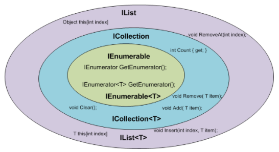

Demystifying `IEnumerable<T>` and `List<T>`
==============================

This tutorial is partially based on [IEnumerable and IEnumerator in C#](https://programmingwithmosh.com/net/ienumerable-and-ienumerator/), and is divied by three parts:

<ul>
  <li>Part A-Background Knowledge</li>
  <li>Part B-Implement a Simple custom IEnumerable and IEnumerator</li>
  <li>Part C-Demystifying <code>List</code> source code</li>
</ul> 

## Part A-Background Knowledge

Before we look into `IEnumerable` and `IEnumerator`, let's revisit some background knowledge on `IList` and `ICollection` too:
```C#
public interface IEnumerable<T> : IEnumerable {
   IEnumerator<T> GetEnumerator();
}

public interface IEnumerable {
   IEnumerator GetEnumerator();
}

public interface IEnumerator<T> : IDisposable, IEnumerator {
   T Current { get; }
}

public interface IEnumerator {
   object Current { get; }
   bool MoveNext();
   void Reset();
}

public interface ICollection<T> : IEnumerable<T>, IEnumerable {
   int Count { get; }
   bool IsReadOnly { get; } 
   void Add(T item);
   void Clear();
   bool Contains(T item);
   void CopyTo(T[] array, int arrayIndex);   // This is quite useful, can be used to get Dictionary's keys, values 
                                             // and also used by List's constructor when using Linq to call ToList();
   bool Remove(T item);   // Removes the first occurrence of a specific object
}

public interface IList<T> : ICollection<T>, IEnumerable<T>, IEnumerable {
   T this[int index] { get; set; }
   
   int IndexOf(T item);
   void Insert(int index, T item);
   void RemoveAt(int index);
}

public interface IList : ICollection, IEnumerable {
   object this[int index] { get; set; }

   bool IsReadOnly { get; }

   int Add(object value);   // note the return is "int" not void
   ...  // same method as IList<T> without generic type
}
```
You can see that `ICollection<T>` is about manipulating item without using index, while `IList<T>` adds bonus features that allows the manipulating with index.



## Part B-Implement a custom IEnumerable and IEnumerator

Consider the following implementation of a List class. (This is an over-simplified example and not a proper/full implementation of the `List` class):
```C#
public class List
{
   public object[] Objects;
 
   public List() {
      Objects = new object[100];
   }
 
   public void Add(object obj) {
      Objects[Objects.Count] = obj;
   }
}

static void Main(string[] args) {
   List list = ...
   var objectArray = list.Objects;
   for (...) {
      // iterate each element in objectArray
   }
}
```
The problem with this implementation is that the List class is exposing its internal structure (`Object[]`) for storing data. This violates the information hiding principle of object-oriented programming. It gives the outside world intimate knowledge of the design of this class. If tomorrow we decide to replace the array with a binary search tree, all the code that directly reference the Objects array need to modified.

So List should not expose their internal structure. This means we need to modify our List class and make the Objects array private:
```C#
public class List
{
   private object[] _objects;
 
   public List() {
      _objects = new object[100];
   }
 
   public void Add(object obj) {
      _objects[_objects.Count] = obj;
   }
}
```
So, with this change, we're hiding the internal structure of this class from the outside. But this leads to a new different problem: how are we going to iterate over this list? We no longer have access to the Objects array, and we cannot use it in a loop.

That's when the ***iterator pattern*** comes into the picture. It provides a mechanism to traverse an object irrespective of how it is internally represented.

`IEnumerable` and `IEnumerator` interfaces in .NET are implementations of the iterator pattern. The client code can use the MoveNext() method to iterate the given object and use the Current property to access one element at a time. Here is an example:
```C#
var enumerator = list.GetEnumerator();
while (enumerator.MoveNext()) {
   Console.WriteLine(enumerator.Current);
}
```
Note that with this interface, the client of our class no longer knows about its internal structure. It doesn’t know if we have an array or a binary search tree or some other data structure in the List class. It simply calls GetEnumerator, receives an enumerator and uses that to enumerate the List. If we change the internal structure, this client code will not be affected whatsoever.

The complete code is:
```C#
static void Main(string[] args) {
    var list = new MyList() { "Hello", "World" };

    var enumerator = list.GetEnumerator();
    while (enumerator.MoveNext()) {
        Console.WriteLine(enumerator.Current);
    }

    enumerator.Reset();             //reset the index so that the list can be iterated again

    while (enumerator.MoveNext()) {
        Console.WriteLine(enumerator.Current);
    }

    foreach (var item in list) {    // foreach block is simply a syntax sugar that uses above GetEnumerator, MoveNext pattern
        Console.WriteLine(item);
    }

    //use generic list
    var list = new MyList<string>() { "Hello", "World" };
    var enumerator = list.GetEnumerator();
    while (enumerator.MoveNext()) {
        Console.WriteLine(enumerator.Current);
    }
}

public class MyList : IEnumerable {
    private object[] _objects;
    private int _size;

    public MyList() {
        _objects = new object[6];
    }

    public void Add(object obj) {
        _objects[_size++] = obj;
    }

    public IEnumerator GetEnumerator() {
        return new ListEnumerator(this);

        //return _objects.GetEnumerator();  can use array's own enumerator but want to implement the details by yourself
    }

    IEnumerator IEnumerable.GetEnumerator() {
        return new ListEnumerator(this);
    }

    private class ListEnumerator : IEnumerator {
        private int _currentIndex = -1;
        private MyList list;

        public ListEnumerator(MyList list) {
            this.list = list;
        }

        public bool MoveNext() {
            _currentIndex++;
            return (_currentIndex < list._objects.Length);
        }

        object IEnumerator.Current {
            get
            {
                try {
                    return list._objects[_currentIndex];
                }
                catch (IndexOutOfRangeException) {
                    throw new InvalidOperationException();
                }
            }
        }

        public void Reset() {
            _currentIndex = -1;
        }
    }
}

//Generic Version
public class MyList<T> : IEnumerable<T> {
    private T[] _objects;
    private int index;

    public MyList() {
        _objects = new T[3];
    }

    public void Add(T obj) {
        _objects[index++] = obj;
    }

    public IEnumerator<T> GetEnumerator() {
        return new ListEnumerator<T>(this);
    }

    IEnumerator IEnumerable.GetEnumerator() {
        return GetEnumerator();
    }

    private class ListEnumerator<T> : IEnumerator<T> {
        private int _currentIndex = -1;
        private MyList<T> list;

        public ListEnumerator(MyList<T> list) {
            this.list = list;
        }

        public bool MoveNext() {
            _currentIndex++;
            return (_currentIndex < list._objects.Length);
        }

        object IEnumerator.Current {
            get
            {
                return Current;
            }
        }

        public T Current {
            get
            {
                try {
                    return list._objects[_currentIndex];
                }
                catch (IndexOutOfRangeException) {
                    throw new InvalidOperationException();
                }
            }
        }

        public void Reset() {
            _currentIndex = -1;
        }

        public void Dispose() {
            ...
        }
    }
}
```
Note that you have to use EIMI (Explicit Interface Method Implementation) in this example because interfaces' method name are the same and you cannot differentiate which method to implement just by different return types.

You should able to see `IEnumerator<T>` is nothing special but just a class that has a private field that references to the underlying data structure (e.g. `List`) plus an currentIndex to indicate which position the enumerator is searching, overridding some methods to facilicate enumeration.

## Part C-Demystifying `List<T>` source code

```C#
public class List<T> : IList<T>, IList, IReadOnlyList<T> {
   private T[] _items;   // you can see that List is a wrapper of Array
   private int _size;    // _size is not the same as _items.Length as when a list is resized i.e  _items = new T[newCapacity], you get the idea

   public List();

   public List(int capacity) {
      if (capacity == 0)
         _items = _emptyArray;
      else
         _items = new T[capacity];
   }

   public List(IEnumerable<T> collection);  // use while loop to add all the items

   public T this[int index] { get; set; } 

   public int Count { get; }   // return _size, which is the length of internally array, this is the property that developers need most of time

   public int Capacity { get; set; }   // the _items.Length
  
   public void Add(T item);

   public void Insert(int index, T item);

   public void AddRange(IEnumerable<T> collection);

   public bool Remove(T item);   // Removes the first occurrence of a specific object
   
   public void RemoveAt(int index);

   public void Clear();

   public ReadOnlyCollection<T> AsReadOnly();

   public int BinarySearch(T item, IComparer<T> comparer);  // Use Array.BinarySearch Method internally

   public int FindIndex(Predicate<T> match);    // return index of the first occurrence if not found, –1.

   public T Find(Predicate<T> match);   // The first element that matches the conditions, if not found; otherwise, return the default value for type T.
                                        // The reason it doesn't return null is you might use the List for value types.

   public List<T> FindAll(Predicate<T> match);

   public void ForEach(Action<T> action);

   public bool Exists(Predicate<T> match); 
   ...
}
```
Implemention Details:

```C#
public class List<T> : IList<T>, IList, IReadOnlyList<T> {
   private const int _defaultCapacity = 4;
   private T[] _items;
   private int _size;  // _size  is not the same as _items.Length as CLR might allocate a lot of free slots in advance just like C++'s Vector

   static readonly T[]  _emptyArray = new T[0];  // possible for performance, make sure only one empty array exists

   // Constructs a List. The list is initially empty and has a capacity of zero.
   // Upon Adding the first element to the list the capacity is increased to 4,
   // and then increased in multiples of two as required.
   public List() {
      _items = _emptyArray;
   }

   public List(int capacity) {
      if (capacity < 0) 
         ThrowHelper.ThrowArgumentOutOfRangeException(ExceptionArgument.capacity, ExceptionResource.ArgumentOutOfRange_NeedNonNegNum);
      if (capacity == 0)
         _items = _emptyArray;
      else
         _items = new T[capacity];
   }

   public List(IEnumerable<T> collection) {
      if (collection==null)
         ThrowHelper.ThrowArgumentNullException(ExceptionArgument.collection);\
      
      // We can use two ways to construct the list
      //Mehotd A if collection is ICollection, so we can use CopyTo method
      ICollection<T> c = collection as ICollection<T>;
      if (c != null) {
         int count = c.Count;
         if (count == 0) {
             _items = _emptyArray;
         }          
         _items = new T[count];
         c.CopyTo(_items, 0);
         _size = count;
      } 
      else {  // Mehotd A if collection is IEnumerable<T>
         ...
         using(IEnumerator<T> en = collection.GetEnumerator()) {
            while(en.MoveNext()) {
               Add(en.Current); 
            }
         }
      }
   }

   public T this[int index] { get; set; }   // manipulate _items[index] internally

   public int Count { 
      get {
        return _size;
      }
   }

   public int Capacity { 
      get {
         return _items.Length; 
      }
      set {
         if (value < _size)
            ThrowHelper.ThrowArgumentOutOfRangeException(ExceptionArgument.value, ExceptionResource.ArgumentOutOfRange_SmallCapacity);
         if (value != _items.Length) {
            if (value > 0) {
               T[] newItems = new T[value];
               if (_size > 0) {
                  Array.Copy(_items, 0, newItems, 0, _size);   // List's performance issue, when resized, a new array is created and
                                                               // the content from old array is copied to this new array, then the old array will be GCed
               }
               _items = newItems;
            } 
            else {
                _items = _emptyArray;       
            }   
         }
      }
   }

   public void Add(T item) {
      if (_size == _items.Length) 
         EnsureCapacity(_size + 1);  //  If required, the capacity of the list is doubled before adding the new element.
      _items[_size++] = item;
   }

   private void EnsureCapacity(int min) {
      if (_items.Length < min) {
         int newCapacity = _items.Length == 0? _defaultCapacity : _items.Length * 2;  
         ...   // unimportant stuff, check the maximum possible capacity (~2G elements)
         Capacity = newCapacity;  // set Capacity property
      }    
   }
   
   public void Insert(int index, T item) {
      if ((uint) index > (uint)_size) {
         ThrowHelper.ThrowArgumentOutOfRangeException(ExceptionArgument.index, ExceptionResource.ArgumentOutOfRange_ListInsert);
      }
      if (_size == _items.Length) {
         EnsureCapacity(_size + 1);
      }        
      if (index < _size) {
          Array.Copy(_items, index, _items, index + 1, _size - index);
      }
      _items[index] = item;
      _size++;
   }

   public void Clear() {
      if (_size > 0) {
         Array.Clear(_items, 0, _size);  // Sets a range of elements in an array to the default value of each element type.
                                         // So for reference types, the internally contains nulls, referenced object will be collected by GC
                                         // Note that the internally array doesn't get resized.
         _size = 0;   // setting _size to 0 already suffice,  but as mentioned above, it would be better for GC to free up the elements
      }
   }

   public ReadOnlyCollection<T> AsReadOnly() {
      return new ReadOnlyCollection<T>(this);
   }

   // Removes the first occurrence of a specific object
   public bool Remove(T item) {   
      int index = IndexOf(item);   // IndexOf call Array.IndexOf<T>(T[] array, T value, int startIndex, int count);
      if (index >= 0) {
         RemoveAt(index);
         return true;
      }
      return false;
   }
   
   public void RemoveAt(int index) {
      if ((uint)index >= (uint)_size) {
         ThrowHelper.ThrowArgumentOutOfRangeException();
      }        
      _size--;
      if (index < _size) {
         Array.Copy(_items, index + 1, _items, index, _size - index);   // List's performance issue, removing an element results in moving a lot of elements
      }
      _items[_size] = default(T);
   }

   //--------IEnumerable Part-----------------------
   IEnumerator<T> IEnumerable<T>.GetEnumerator()  {
      return new Enumerator(this);    
   }

   System.Collections.IEnumerator System.Collections.IEnumerable.GetEnumerator() {
       return new Enumerator(this);    
   }
   
   // helper method
   public Enumerator GetEnumerator() {
      return new Enumerator(this);
   }

   public struct Enumerator : IEnumerator<T>, System.Collections.IEnumerator {  
      private List<T> list;
      private int index;
      private T current;

      internal Enumerator(List<T> list) {
         this.list = list;
         index = 0;
         current = default(T);
      }
      
      public T Current => _current!;

      public bool MoveNext() {
         // ...
      }

      void IEnumerator.Reset() {
         _index = 0;
         _current = default;
      }

      public void Dispose() { }   // empty method, not sure why C# team does it like this
   }
}
```
A couple things to note:

1-`List<T>`'s internal data structure that stores items is an array `T[]`, when you first create a List, its capacity is 0, when you first add an element, the capacity becomes 4, then everytime it needs to be resized, its capacity get doubled.

2-`List<T>` uses Array's static methods such as  `Array.Copy(...)`, `Array.Clear(...)` heavily. Note that `Array.Copy(...)` method does't create a new array internally and let the GC to reclaim the old array. All those staic  methods operate on existing array, for example, `Array.Reverse(...)` reverse between start and end index, then start++ and end-- and so on. `Array.Clear(...)` makes the elements to be default value. But when the List is resized for more capacity, it does create a new array and copy elements from old array to new array, which is a performance hit.

3-`List<T>` does have a drawback which is when you resize or remove(most of time, unless you remove the last element) an element, it will call `Array.Copy(...)` internally which will move a lot of elements after the added/removed element. Adding an element is efficient unless it results in resizing because adding an elements adds the element at the end of the array most of time.

Also note that `public List(IEnumerable<T> collection)` is used for Linq's ToList method:
```C#
namespace System.Linq {
   public static partial class Enumerable {
      ...
      public static List<TSource> ToList<TSource>(this IEnumerable<TSource> source) {
         if (source == null) 
            throw Error.ArgumentNull("source");
         return new List<TSource>(source);
      }   
   }
}
```


#### Yield Return 

```C#
// an example of using yield break and yield return 
public IEnumerable<T> EnumerateThroughNull<T>(IEnumerable<T> source)
{
    if (source == null)
        yield break;

    foreach (T item in source)
        yield return item;
}
```

https://devblogs.microsoft.com/oldnewthing/20080812-00/?p=21273

```C#
public class MyClass {
   private int limit;

   public MyClass(int limit) { this.limit = limit; }

   public IEnumerable<int> CountFrom(int start)
   {
      for (int i = start; i <= limit; i++)
         yield return i;
   }
}
```

The compiler internally converts it to:

```C#
public class MyClass {
   private int limit;

   public MyClass(int limit) { this.limit = limit; }

   public IEnumerable<int> CountFrom(int start)
   {
      MyClass_Enumerator e = new MyClass_Enumerator();
      e.this$0 = this;
      e.start = start;
      return e;
   }
}

public class MyClass_Enumerator : IEnumerable<int>
{
   int state_$0 = 0;  // internal member
   int current$0;    // internal member
   MyClass this$0;   // implicit parameter to CountFrom
   int start;        // explicit parameter to CountFrom
   int i;            // local variable of CountFrom

   public int Current {
      get { return current$0; }
   }

   public bool MoveNext()
   {
      switch (state$0) {
         case 0: goto resume$0;
         case 1: goto resume$1;
         case 2: return false;
         //…
         //case n: goto resume$n;
         // case n2: return false;
      }
   }

   resume$0:;
     for (i = start; i <= this$0.limit; i++) {
        current$0 = i;
        state$0 = 1;
        return true;
   resume$1:;
     }

   state$0 = 2;
   return false;
   }
      // other bookkeeping, not important here …
   }
}
```

<style type="text/css">
.markdown-body {
  max-width: 1800px;
  margin-left: auto;
  margin-right: auto;
}
</style>

<link rel="stylesheet" href="./zCSS/bootstrap.min.css">
<script src="./zCSS/jquery-3.3.1.slim.min.js"></script>
<script src="./zCSS/popper.min.js"></script>
<script src="./zCSS/bootstrap.min.js"></script>